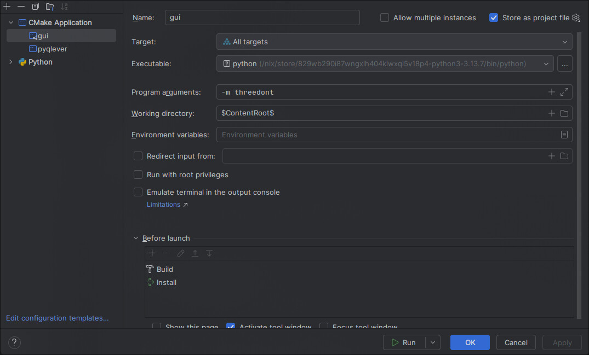
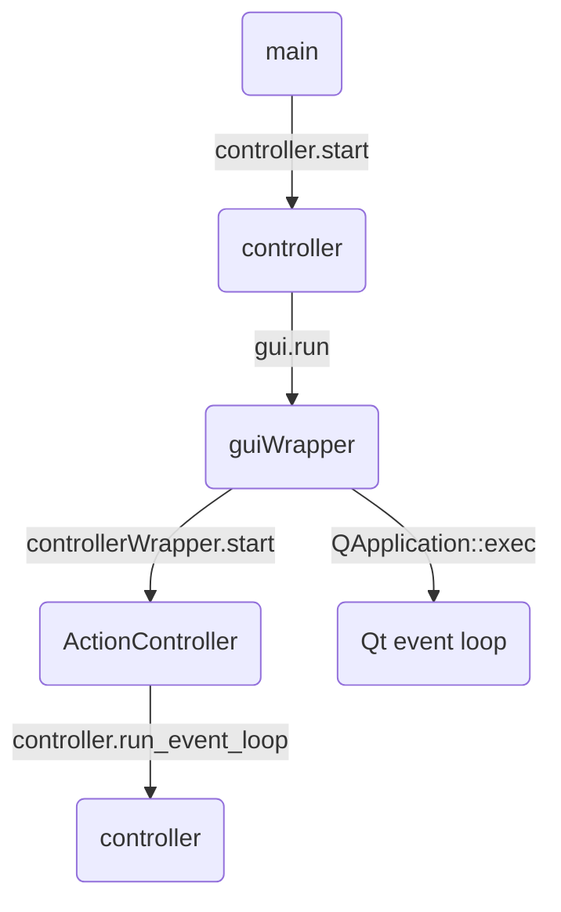
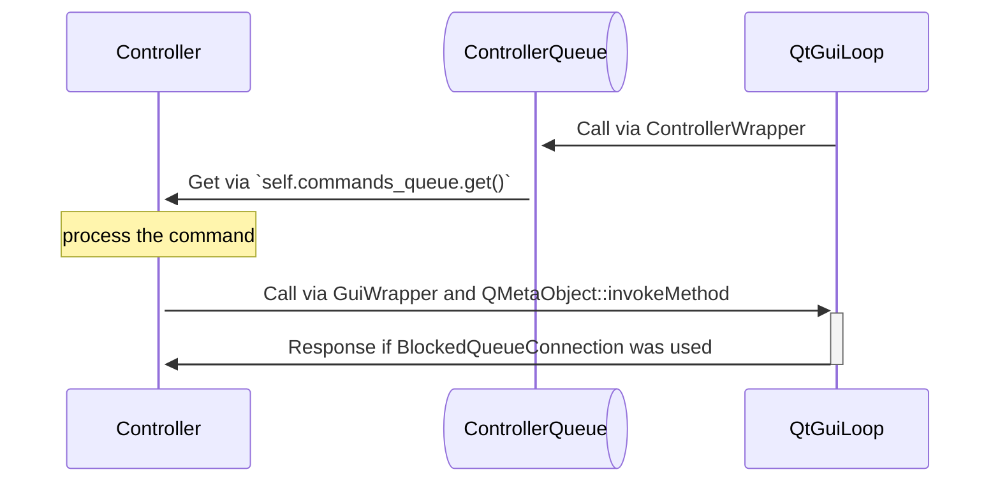

# 3dont Development Manual

> [!IMPORTANT]
> Be sure to have read the [User Guide](./USER_GUIDE.md) and familiarized
> yourself with this software's features before reading!

## Development environment
As described in the user guide, nix can be used to gather the right version of every dependency.
Just run `nix develop` from the root of the project to enter a shell with the right dependencies installed.
There you can use cmake test the project build. Set `-DCMAKE_INSTALL_PREFIX=install -DTHREEDONT_DEVELOP_BUILD=on` and
then use cmake install to put the compiled python modules inside the source tree, then run `python -m threedont` to
start the application. 
You can configure CLion or similar IDEs to use the dependencies from nix, just start them from the `nix develop` shell,
configure them to use nix's cmake (`which cmake`) and set the right variables (mentioned above). 
To have the run available in CLion I use a Cmake Application run config, that dependes on all targets, runs a custom executable 
(the python from `which python`, that has the right deps installed) with program arguments `-m threedont`, working directory
`$ContentRoot$` and runs both build and install before launch.


## Module structure
The app structure is quite complex, it evolved a lot and started from an already complex structure (the pptk viewer). 
Inside the `threedont` directory there are two main subdirectories: `app` and `gui`. The others contains the code for
specific 3dont features.

The `gui` directory contains all the gui code: the 3d viewer and the surrounding view, all written in Qt6 with some OpenGL code in the
viewer.  
There are also the `gui_wrapper` files, with contains the Cpython binding to the gui. They leverage qt's `QMetaObject::invokeMethod` for
safe cross thread calls.

The software is developed using the [MVC](https://it.wikipedia.org/wiki/Model-view-controller) pattern, you can find the controller
at `app/controller.py`. That file should remain minimal and just interface the `db.py` (the model) with the gui (`gui_wrapper` and
`viewer.py`). 

### Communication
Since python does not support real multithreading (free multithreading wasn't possible when this software was created), there is 
quite a complex communication structure; there are two threads, the gui thread and the controller/logic thread. The gui thread must
be the main thread, this is a requirement of some OSs. 
The initialization logic is like this:

The gui is written in C++, so it uses the controller wrapper to call the controller, while the controller uses the gui wrapper
to interact with the gui.

Everyone carefully acquires the GIL and calls `Py_THREADS_ALLOW` in order to let the two thread operate.
The gui and controller threads schedules commands and action in the others thread queue. The gui queue is the Qt event loop while
the controller uses a python queue to store function names and arguments.
The controller queue management is done via a middleware, the `ActionController`, that via `__getattr__` sends commands to the controller.
Basically, when the gui calls `controllerWrapper.select_query(query)`, `controllerWrapper` converts it to python types and then calls
`actionController.select_query(query)`. This is just a facade that puts in the controller queue `('select_query',('...query'))`.
Then the controller pops from the queue and calls that methods. This is kinda like an async call system.

On the other side is a little easier. The controller calls `guiWrapper.set_statusbar_content("Text",1)`, the GuiWrapper function 
converts from python to qt types and then calls `QMetaObject::invokeMethod(self->mainLayout,"setStatusbarContent",Qt::QueuedConnection,Q_ARG(QString,QString(content)),Q_ARG(int, seconds));`,
 this schedules the `setStatusbarContent` slot call in the `mainLayout` event loop. `QueuedConnection` doesn't wait for the execution.
In other locations `BlockingQueuedConnection` to get the slot return value, calling `Py_BEGIN_ALLOW_THREADS` before in order
to not block the GIL.
Here there is a scheme:


The viewer used to have a tcp server to receive messages to control it, and the first rule of programming is:
 `if something works, don't touch it.`. So I didn't touch it until I hade some time to convert the tcp logic to 
 a buffer passing approach. It uses the same code, but instead of a tcp connection it uses QByteArrays. It's still
 ugly but a little bit better (not tcp self connections...).

So every `viewer.do_this` call internally uses `viewer.__send`, that uses `ControllerWrapper.send_viewer_command`, which
sends the buffer and optionally waits for a response buffer, with `QMetaObject::invokeMethod(self->mainLayout, "sendViewerCommand"...`
as usual.


## Modules

### Viewer
In `gui/viewer` lives the 3d viewer code. It was a terrible mess, now it's a little better. 
It uses OpenGL to accelerate the rendering, via `QOpenGLWidget`. In `viewer.cpp` there is a lot of interesting code,
the slots that handles the various events (mouse, keyboard, etc...), the command processing (actions buffers) and 
the rendering pipeling. That pipeline might be divided in a state machine function, that schedules the next state processing
in the qt event loop, in order to not block the loop for too much while rendering. A different frame buffer must be used when 
fine rendering, in order to not touch the current one.

### Gui
The gui is a normal qt application, it has an ui file (edit it with qt designer) with the ui structure, the `main_layout` class
that handles all the logic and some other components. 

`controller_wrapper` is a c++ wrapper over the python controller interface. 

`gui_wrapper` is a cpython wrapper over the gui.

`points_tree_view` contains the code necessary for the node details tree view, using Qt's abstract data interface.

### Storage
The controller interacts with the sparql source via the `db.py` file, which contains the `SparqlBackend` class. 
This class converts from sparql results to more pythonic structures, stores mapping from point IDs and IRIs, coordinates and IRIs
(nl select queries returns coordinates) and so. 
It relies on an abstract storage. The `AbstractStorage` interface is in `app/storage/abstract_storage.py`, the methods are
describet there. In order to provide an implementation of `AbstractStorage` the `StorageFactory` is used (`app/storage/storage_factory.py`),
is can be used to annotate a class as a registered class storage, it will be instantiated using the assigned priority and type (local/remote),
an example: 
```
@StorageFactory.register(is_local=False, priority=10)
class SparqlWrapperStorage(AbstractStorage):
```
Just make sure to import the files that defines the concrete storage in the `storage/__init__.py`.
There is an abstract type also for query results, defined in `app/storage/query_handlers/query_result.py`, this is an abstraction
that let us chunk queries on certain endpoints without duplicating too much code, it executes the query on creation.

There is a `qlever` concrete storage implementation, using cpython for interacting with `libqlever`. It's defined in `app/storage/qlever` and
instantiated as abstract storage in `app/storage/qlever_storage.py` (this approach is much easier than using cpython inheritance).
